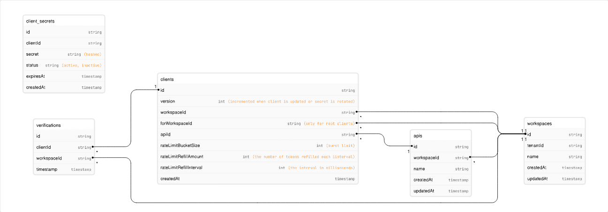

<!--- Eraser file: https://app.eraser.io/workspace/iM0oefDcpBUj4W1UKNPV --->

# Requirements

- Create workspaces
- Create apis
- Create root OAuth client credentials that allows for creating clients
- Create OAuth client credentials for those apis
- Create jwts using those client credentials
- Support validation of scopes
- Support individual workspaces and team workspaces

# Routes

- POST /internal.createWorkspace
- POST /internal.createRootClient
- POST /apis.createApi
- POST /clients.createClient
- POST /clients.rotateSecret
- POST /clients.verifyClient
- POST /oauth/token

# Data Model

# Client Types

1. Internal Client
   1. This is a static client that belongs to an internal organization. It allows the creation of workspaces and root clients.
2. Root Clients
   1. These are keys that belong to the workspaces of users of Optra. They can create APIs and clients for those workspaces only.
3. Basic Clients
   1. These are clients that belong to users of the APIs that are managed by Optra. They can't create anything and can only be verified.

# Rate Limiting

Basic token bucket rate limiting. Configurable bucket size, refill amount, and refill interval.
